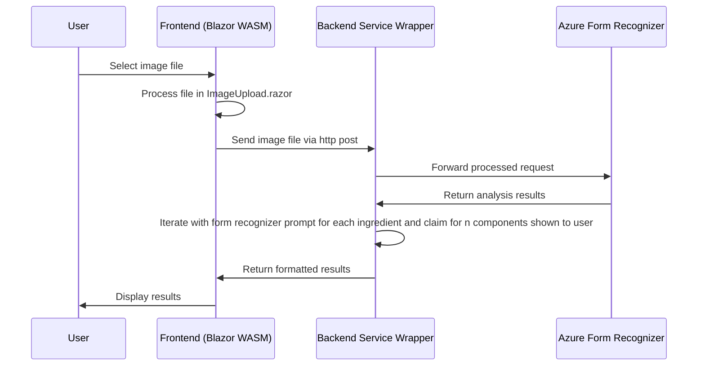

```mermaid
sequenceDiagram
participant User
participant Frontend as Frontend (Blazor WASM)
participant Backend as Backend Service Wrapper
participant Azure as Azure Form Recognizer

User->>Frontend: Select image file
Frontend->>Frontend: Process file in ImageUpload.razor
Frontend->>Backend: Send image file via http post
Backend->>Azure: Forward processed request
Azure->>Backend: Return analysis results
Backend->>Backend: Iterate with form recognizer prompt for each ingredient and claim for n components shown to user
Backend->>Frontend: Return formatted results
Frontend->>User: Display results

```