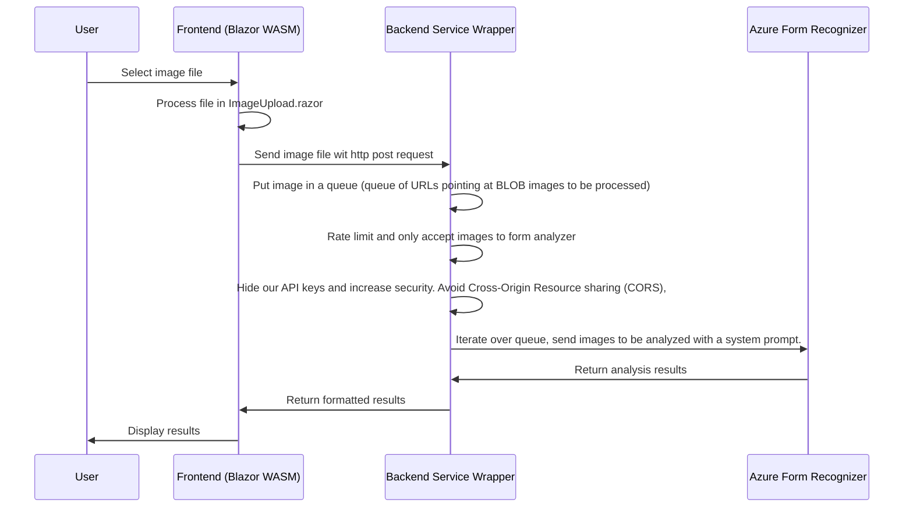

## Azure AI form recognizer provides an analysis about what you're eating and how healthy it is.

- Present user with an image upload button.
- User uploads image of ingredients label
- Web client/ios/android sends HTTP POST of the image to our Web API App (Wrapper for Azure AI Form Analyzer API)
- Our Console App Wrapper passes the image to the Form service, makes sure we received only image data, hides our API key, and load limits our service. 
- Images to be proceessed are stored in a queue. It will be a queue of URLs (URLs point to Azure blob storage).

- Can easily add a macros visual calculator similar to CalAI, the AI might also hold your macros in context for future ingredients labels you're scanning.
- The reason is, you might have hit your target fat, sugar, carbs or protein intake for the day, and you want to notify the user and store the data.

