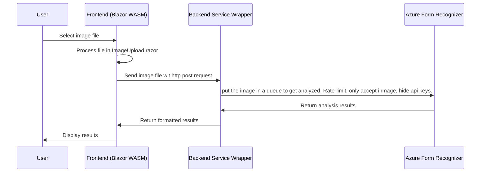

## Azure AI form recognizer provides an analysis about what you're eating and how healthy it is.

- Present user with an image upload button.
- User uploads image of ingredients label
- Web client sends HTTP POST of the image to our console app (Wrapper for Azure AI Form Analyzer API)
- Our Console App Wrapper passes the image to the Form service, makes sure we received only image data, hides our API key, and load limits our service. 
- Images to be proceessed are stored in a queue. It will be a queue of URLs (URLs point to blob image storage on cloud).

